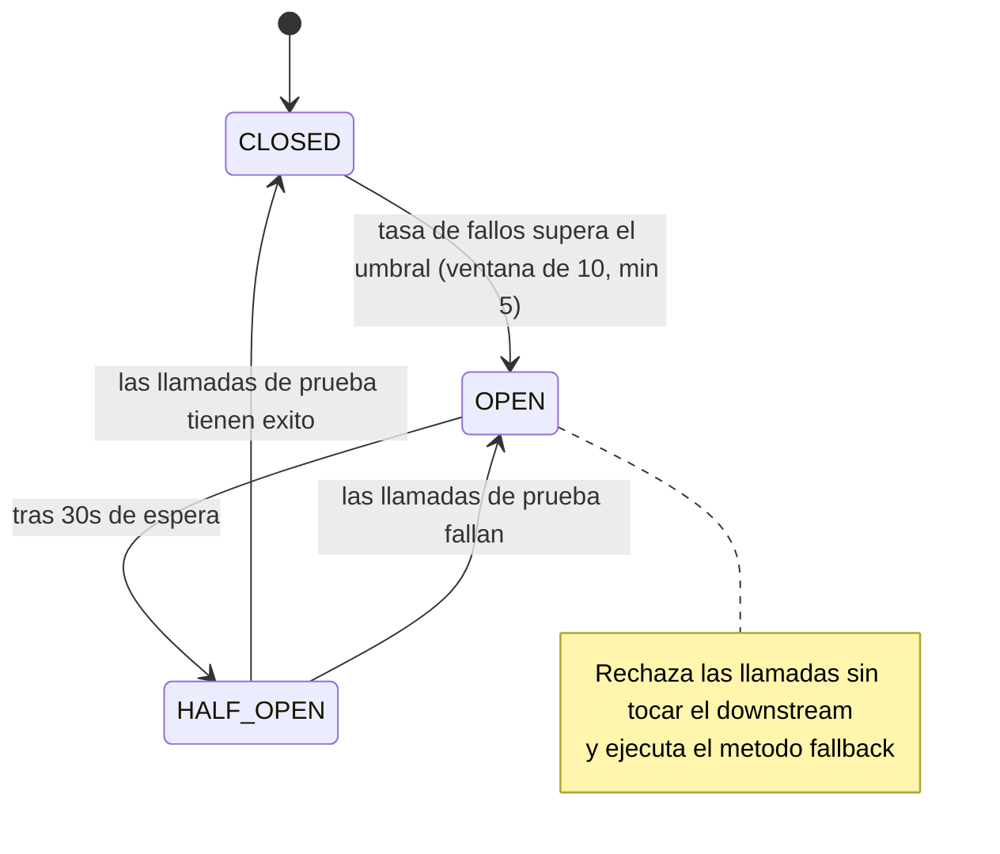
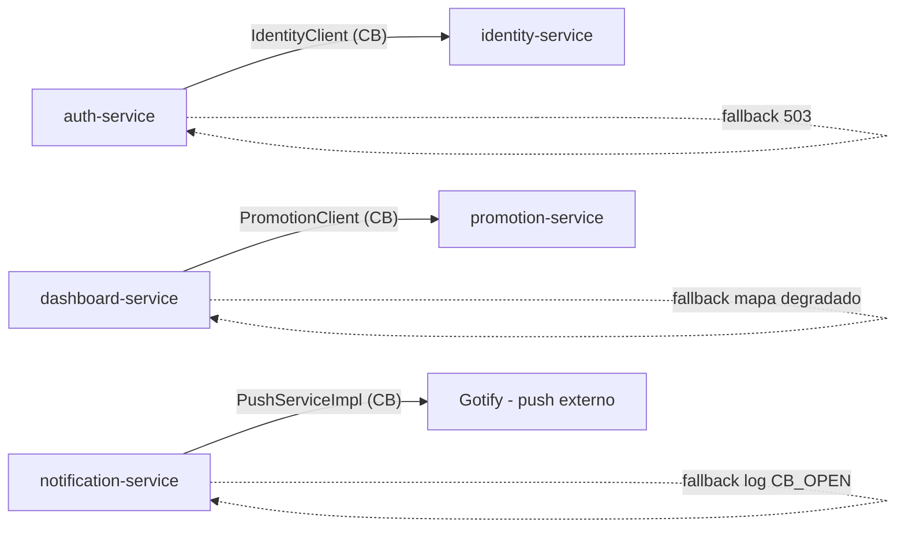
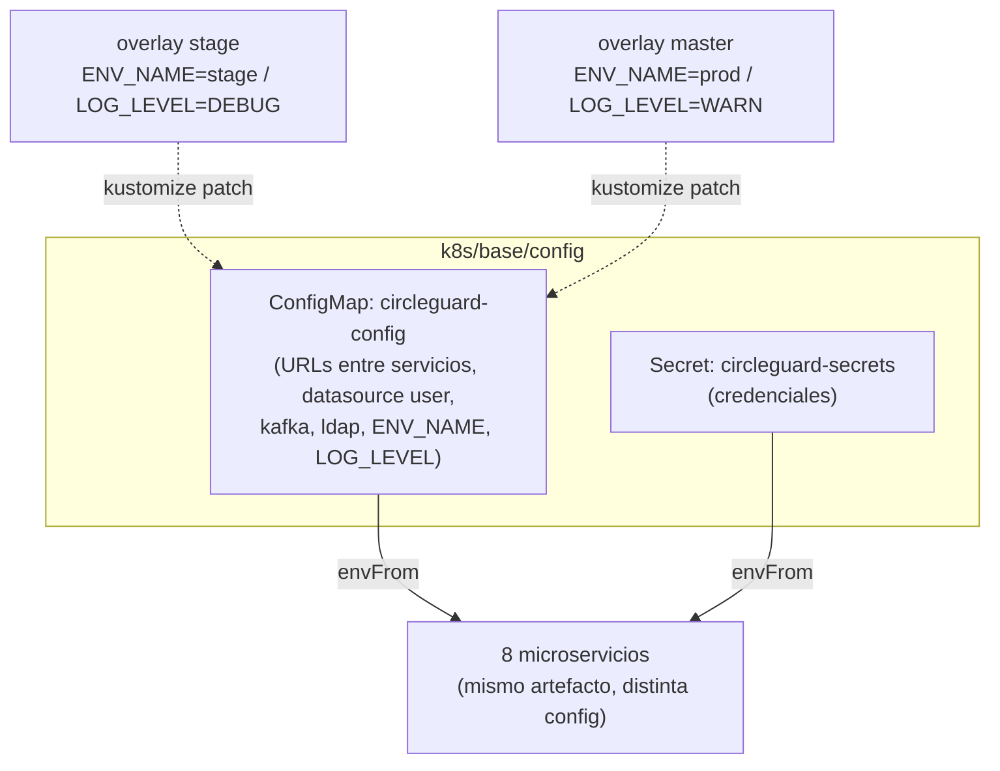
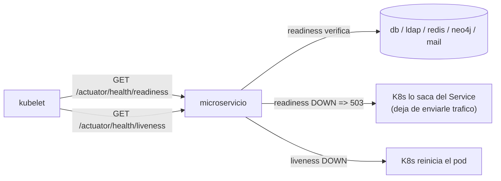
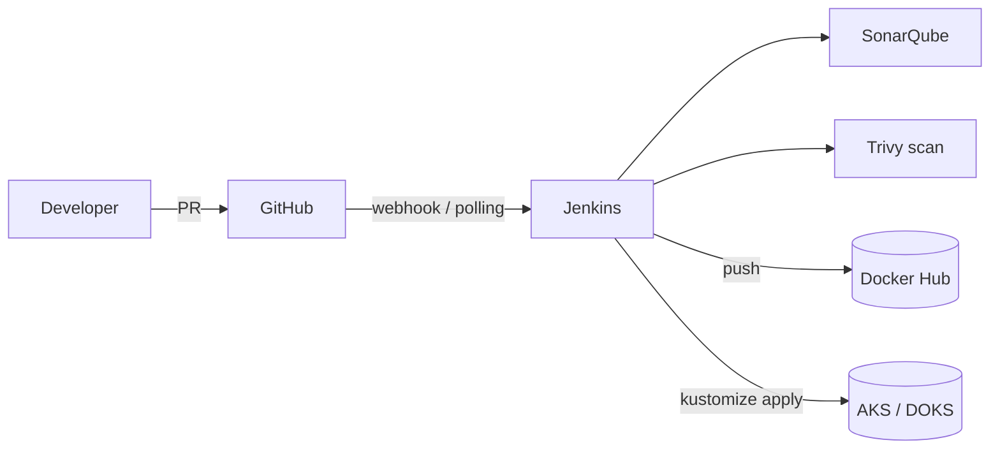
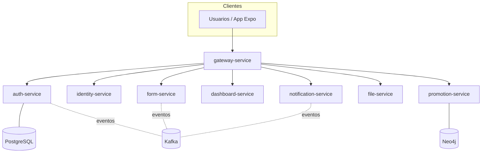
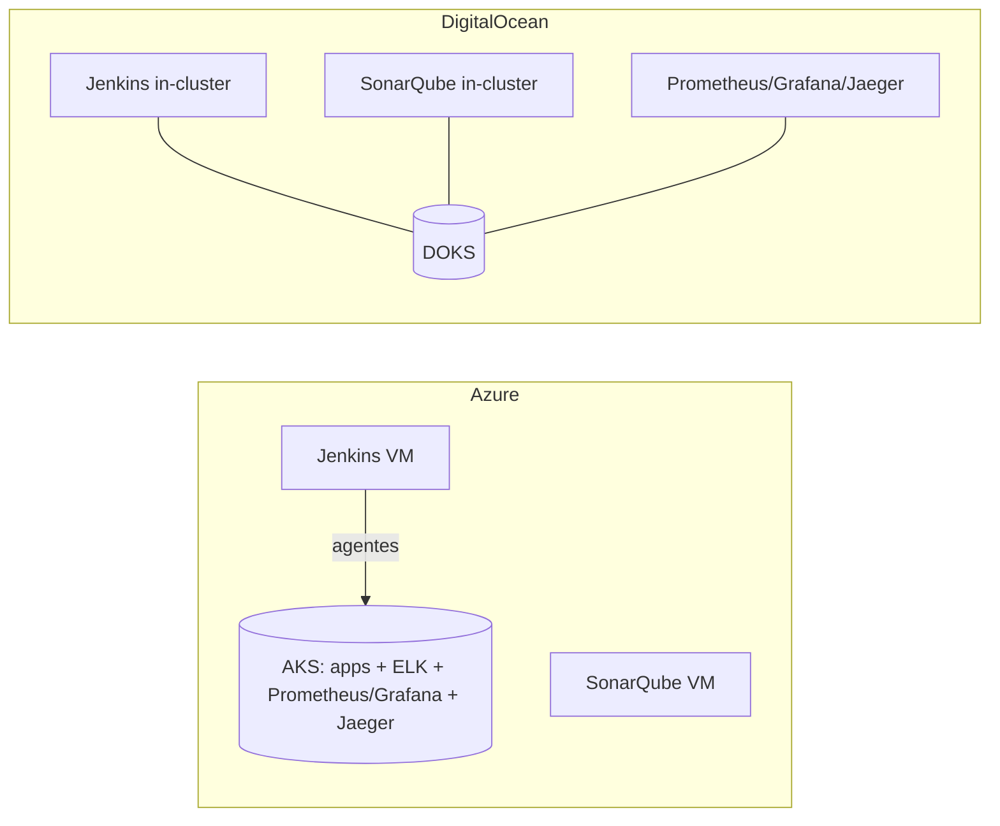

# Informe Final — CircleGuard (IngeSoft V)

Documento **único y autocontenido** del Proyecto Final, organizado según los
requisitos del enunciado. Reúne metodología, infraestructura, patrones, CI/CD,
pruebas, observabilidad, seguridad, documentación, bonificaciones y entregables.

> **Proyecto:** CircleGuard — 8 microservicios Spring Boot (auth, identity, form,
> file, dashboard, notification, gateway, promotion) sobre Kubernetes, desplegados
> en **Azure (AKS)** como primario y **DigitalOcean (DOKS)** como secundario.
>
> **Enlaces:** [Project board](https://github.com/users/ItsJuanda17/projects/3) ·
> [Issues](https://github.com/prapoju/circle-guard-public/issues) ·
> [Milestones](https://github.com/prapoju/circle-guard-public/milestones)

---

# 1. Metodología Ágil y Estrategia de Branching (10%)

## 1.1 Metodología: Kanban

Dado el tamaño del equipo y la duración, Scrum exige más overhead del
que se justifica (roles, sprints con compromiso fijo, ceremonias). **Kanban**
encaja mejor: flujo continuo, sin congelar el alcance y con ajuste de prioridades
sin esperar al cierre de un sprint. Las iteraciones son cadencias marcadas con
**milestones de GitHub**.

**Tablero (4 columnas):**
- `Backlog`: HU priorizada y lista (cumple DoR). Sin límite.
- `In Progress`: en una rama `feat/*`. **WIP máx. 2 por persona**.
- `In Review`: PR abierto con checks corriendo (límite suave: 5).
- `Done`: mergeada a `develop`, DoD cumplida.

**Ceremonias:** mínimas: standup async diario, refinamiento bajo demanda, revisión
obligatoria por PR (al menos un reviewer distinto del autor).

**Métricas:** cycle time (<5 días), throughput semanal (≥5 en M1, ≥8 en M2), WIP
promedio, antigüedad del backlog.

**Priorización:** (1) bloqueantes primero (p. ej. Terraform antes que Prometheus),
(2) peso en el enunciado (Terraform 20%, CI/CD 15% temprano), (3) bonificaciones
solo cuando el 100% del alcance base está en `Done`.

## 1.2 Estrategia de branching: GitFlow

Hay tres ambientes (dev/stage/prod) y la entrega exige aprobación manual a producción
y release notes por tag → mapea a `release/*` y tags sobre `master`.

```
master (producción, recibe solo de release/* o hotfix/*)
  └─ develop (integración del día a día)
       ├─ feat/<descripcion>
       ├─ fix/<descripcion>
       ├─ docs/<descripcion>
       ├─ release/<version>   (de develop → master + develop, genera tag)
       └─ hotfix/<version>    (de master → master + develop, genera tag)
```

- **Prefijos válidos:** `feat/`, `docs/`, `fix/`, `chore/`, `test/`, `release/`, `hotfix/`.
- **PRs:** nunca push directo a `master`/`develop`; objetivo <400 líneas; ≥1 reviewer;
  squash & merge (merge commit en release/hotfix).
- **Commits:** Conventional Commits (`feat`, `fix`, `docs`, `chore`, `refactor`,
  `test`, `perf`, `ci`, `build`, `revert`).
- **Protección de ramas:** en `master` se exige PR, 1 aprobación, todos los checks
  (build, tests, Sonar, Trivy), historia lineal, sin force-push. En `develop`, checks
  más livianos (build + tests).

## 1.3 Gestión del proyecto: GitHub Projects

Toda la trazabilidad HU ↔ código vive en GitHub (issues, PRs, commits, labels,
milestones). Project v2 [CircleGuard - Proyecto Final](https://github.com/users/ItsJuanda17/projects/3),
owner `ItsJuanda17`, `prapoju` como admin.

- **Labels de épica** (una por requisito): `epic:metodologia`, `epic:terraform`,
  `epic:patrones`, `epic:cicd`, `epic:pruebas`, `epic:releases`, `epic:observabilidad`,
  `epic:seguridad`, `epic:documentacion`.
- **Labels de bonus:** `bonus:multicloud`, `bonus:servicemesh`, `bonus:chaos`, `bonus:finops`.
- **Soporte:** `type:story|task|bug`, `priority:high|medium|low`.
- **Workflows automáticos:** ítem agregado → `Backlog`; PR mergeado → `Done`; issue
  cerrado → `Done`; issues nuevos del repo se agregan al project.

## 1.4 Iteraciones

| Iteración | Milestone | Inicio | Cierre | HU |
|---|---|---|---|---|
| 1 | Fundamentos | 2026-05-16 | 2026-05-26 | 18 |
| 2 | Completitud + Bonus | 2026-05-27 | 2026-06-08 | 28 + 4 bonus |

- **Iteración 1 (Fundamentos):** GitFlow + branch protection, tablero Kanban con las
  46 HU, documentación de metodología, Terraform modular para los 3 ambientes con
  backend remoto, diagramas, los 3 patrones nuevos, CI sobre PRs (build/tests/Sonar/Trivy),
  probes en todos los servicios, Prometheus + Grafana con dashboards, secretos fuera
  del código y RBAC inicial.
- **Iteración 2 (Completitud + Bonus):** CD con promoción dev→stage→prod y aprobación
  manual, versionado automático + release notes, suite completa de pruebas (unit/integración/E2E/Locust/ZAP),
  ELK + tracing + métricas de negocio con alertas, TLS, escaneo continuo, documentación
  restante, y las 4 bonificaciones.

## 1.5 Definición de Ready (DoR) y Done (DoD)

**DoR.** Una HU se puede tomar cuando: título `US-XX: <verbo> <objeto>`, descripción
tipo HU (`Como <rol>, quiero <funcionalidad> para <beneficio>`), ≥2 criterios de
aceptación verificables, labels de épica + milestone, y sin dependencias bloqueadas.

**DoD.** Una HU pasa a `Done` cuando: criterios cumplidos, código según convenciones
(sin TODOs sueltos ni secretos hardcodeados), pruebas unitarias agregadas/actualizadas
(cobertura no baja del baseline), CI verde (build/tests/lint/Sonar/Trivy sin nuevas
vulnerabilidades HIGH/CRITICAL), documentación actualizada, PR revisado por alguien
distinto del autor y mergeado a `develop`.

## 1.6 Evidencia

**Tablero Kanban en GitHub Projects**


**Workflows del Project que automatizan el tablero**


**Ramas del repositorio bajo GitFlow (master, stage, develop, feat/*, fix/*, test/*)**


**Milestones de las iteraciones (M1 Fundamentos y M2 Completitud + Bonus, 100% completados)**


---

# 2. Infraestructura como Código con Terraform (20%)

| Requisito | Implementación |
|---|---|
| Infra con Terraform | AKS, DOKS y VMs de plataforma (Jenkins/SonarQube) |
| Estructura modular | `terraform/modules/aks`, `modules/doks`, `modules/platform` |
| Múltiples ambientes | Overlays Kustomize: `stage`/`master` (Azure) y `do-dev`/`do-stage`/`do-master` (DO) |
| Backend remoto | Azure Blob (`cgpaccount/tfstate`) para AKS · DO Spaces S3 (`circleguard-tfstate-do-jda`) para DOKS |
| Diagramas | Ver §10 (Arquitectura) |

- **Azure:** `terraform/` con módulo `modules/aks` (cluster con node pools
  `default`/`stage`/`master`) y `modules/platform` (VMs de Jenkins y SonarQube con IP pública).
- **DigitalOcean:** `terraform/digitalocean/` con módulo `modules/doks` (cluster
  `circleguard-doks`, nyc3, node pool `s-4vcpu-8gb`). El `node_count` parametriza el
  tamaño del cluster.
- El estado nunca es local: cada cloud tiene su backend remoto, lo que permite trabajo
  colaborativo y bloqueo de estado.

## 2.1 Definición declarativa por módulo

La infraestructura se define de forma **declarativa y modular**. Cada cluster vive
en su propio módulo reutilizable, y la raíz solo invoca esos módulos pasándoles variables:

- **`terraform/modules/aks/main.tf`** declara el `azurerm_kubernetes_cluster` con sus
  tres node pools (`default`, `stage`, `master`) — define el cluster de **Azure**.
- **`terraform/modules/doks/main.tf`** declara el `digitalocean_kubernetes_cluster`
  con su node pool — define el cluster de **DigitalOcean**.
- **`terraform/modules/platform/main.tf`** declara las VMs de Jenkins y SonarQube de Azure.
- La raíz `terraform/main.tf` (Azure) y `terraform/digitalocean/main.tf` (DO) solo
  hacen `module "..." { source = "../modules/..." }` con sus variables — sin duplicar
  lógica. El estado se guarda en **backend remoto** (Azure Blob para AKS, DO Spaces
  S3 para DOKS).

## 2.2 Evidencia

**Estructura modular** (`terraform/` con `modules/aks`, `modules/doks`, `modules/platform`):


**Estado en backend remoto (DOKS).** `terraform state list` leído desde DO Spaces:


**Infraestructura desplegada (AKS).** Los 3 node pools (`default`/`master`/`stage`) que define declarativamente `modules/aks`:


---

# 3. Patrones de Diseño (10%)

## 3.1 Patrones existentes identificados

| Patrón | Categoría | Dónde |
|---|---|---|
| Database per Service | Datos | Cada servicio con su BD aislada (PostgreSQL; promotion suma Neo4j) |
| Event-Driven Architecture | Comunicación | `spring-kafka` en 4 servicios (listeners + producers) |
| Retry | Resiliencia | `spring-retry` (`@Retryable` + `@Recover`) en push/email/SMS |
| BFF (parcial) | Arquitectura | dashboard-service agrega datos; notification adapta payloads |
| External Configuration (parcial) | Configuración | `application.yml` con `${VAR:default}` |
| Health Check (básico) | Operativo | readinessProbe TCP |
| Service Discovery (implícito) | Operativo | DNS de Kubernetes |

## 3.2 Patrones nuevos implementados

### Circuit Breaker (resiliencia)
**Resilience4j** (`resilience4j-spring-boot3:2.2.0`). Tres puntos:

| Cliente | Servicio | Llama a | Instance |
|---|---|---|---|
| `IdentityClient` | auth-service | identity-service | `identityService` |
| `PromotionClient` | dashboard-service | promotion-service | `promotionService` |
| `PushServiceImpl` | notification-service | Gotify (push externo) | `gotifyApi` |

Config base: `failureRateThreshold: 50%`, `slidingWindowSize: 10`,
`minimumNumberOfCalls: 5`, `waitDurationInOpenState: 30s`, `permittedNumberOfCallsInHalfOpenState: 3`.
Estados CLOSED → OPEN (al superar el umbral, rechaza y ejecuta fallback) → HALF_OPEN
(llamadas de prueba) → CLOSED/OPEN. Fallbacks por cliente (503, mapa degradado, log
`CB_OPEN`). Test: `IdentityClientCircuitBreakerTest` valida los 4 escenarios.

**Diagrama: máquina de estados del Circuit Breaker**



**Diagrama: dónde está aplicado (3 puntos)**



### External Configuration (mejorado)
Antes: variables repetidas en cada deployment y `SPRING_DATASOURCE_PASSWORD: password`
en YAML versionado. Ahora: un **ConfigMap común** (`circleguard-config`) + un **Secret
común** (`circleguard-secrets`), con override por ambiente vía Kustomize. Los deployments
consumen con `envFrom`; solo `SPRING_DATASOURCE_URL` queda por servicio (BD distinta).
Overlays: `stage` → `ENV_NAME: stage`, `LOG_LEVEL: DEBUG`; `master` → `prod`/`WARN`.

**Diagrama: External Configuration con ConfigMap + Secret y override por overlay**



### Health Check con Spring Boot Actuator
Antes los probes eran `tcpSocket` (solo verificaban puerto abierto). Ahora cada servicio
expone `/actuator/health/readiness` (estado + dependencias críticas: db, ldap, redis,
neo4j, mail según el servicio) y `/actuator/health/liveness` (solo `livenessState`, sin
dependencias para evitar reinicios en cascada). Spring Boot autoconfigura los
`HealthIndicator`. Probes en los deployments: readiness (delay 30s, cada 10s, fail 10),
liveness (delay 60s, cada 20s, fail 6).

**Diagrama: Health Check (readiness vs liveness)**




# 4. CI/CD Avanzado (15%)

## 4.1 Pipelines

Jenkins con tres pipelines encadenados (agentes como **Pods efímeros** en `jenkins-agents`):

| Pipeline | Etapas | Archivo |
|---|---|---|
| `dev` | Compile · Unit Tests · **SonarQube + Quality Gate** · Integration Tests · Build imágenes · **Trivy** · Push a Docker Hub | `pipelines/dev/Jenkinsfile` |
| `stage` | Deploy a stage · **E2E (Newman)** · **Stress (Locust)** · **ZAP** · artefactos | `pipelines/stage/Jenkinsfile` |
| `master` | **Approval manual** · Deploy a master · **Release Notes** + tag | `pipelines/master/Jenkinsfile` |

## 4.2 Dónde vive el CI (diferencia clave entre clouds)

- **Azure:** Jenkins y SonarQube en **VMs dedicadas**; Jenkins se conecta al AKS y
  lanza los agentes como pods. El controller sobrevive aunque el cluster se recree.
- **DigitalOcean:** Jenkins (Helm) y SonarQube (+ PostgreSQL) corren **dentro del
  cluster DOKS**. Más simple/barato, pero acoplado al cluster.



## 4.3 Requisitos del punto

- **SonarQube** (análisis estático + Quality Gate) en `dev`.
- **Trivy** (escaneo de imágenes) en `dev`; reportes `trivy-analysis-*.txt` archivados.
- **Versionado automático**: el job `master` genera `v<fecha>-<sha_repo>-<sha_imagen>`
  y crea el tag/release.
- **Aprobación a producción**: `input` manual (timeout 24 h) antes de desplegar a master.
- **Validación de PRs**: en DO vía job **multibranch** `circleguard-pr` (JCasC + JobDSL,
  descubre PRs por polling, postea commit status con un PAT classic); en Azure vía
  GitHub App. Aparece como check `continuous-integration/jenkins/pr-merge`.
- **Notificaciones de fallo**: resumen de resultados en el bloque `post` (notificación
  a canal externo: pendiente).

## 4.4 Evidencia visual (capturas del setup)

**Setup de Jenkins**


**Integración con GitHub mediante GitHub App (webhook, permisos, llave privada y uso de credenciales en Jenkins)**


**SonarQube (instalación, webhook y generación de token)**


> El paso a paso completo del setup (más capturas de permisos, ulimit, vm.max_map_count, etc.) está en `capturas/proyecto/`.

**Pipeline `dev` ejecutado en verde, con todas las etapas (Checkout, Compile, Unit Tests, Static Analysis, Quality Gate, Package, Integration Tests, Build Images, Security Scan, Push)**


**Validación de PR con el check de Jenkins en GitHub**


**SonarQube: proyecto circleguard con Quality Gate "Passed"**


---

# 5. Pruebas Completas (15%)

| Tipo | Herramienta | Evidencia |
|---|---|---|
| Unitarias | Gradle (`:test`) | etapa Unit Tests (`dev`) |
| Integración | docker-compose por servicio (`docker-compose.integration.yml`) | etapa Integration Tests (`dev`) |
| E2E | Newman (colección Postman) | `tests/e2e/`, etapa E2E (`stage`) |
| Rendimiento/estrés | **Locust** (4 perfiles: estudiante, visitante, personal de salud, guardia) | `tests/stress/locustfile.py` |
| Seguridad (DAST) | OWASP ZAP (baseline) | etapa ZAP (`stage`) |
| Cobertura/calidad | SonarQube | dashboard Sonar |


## 5.1 Evidencia


### Pruebas unitarias con Gradle (etapa `Unit Tests` del pipeline `dev`)

`./gradlew :test` por servicio; ejemplo `[auth] Unit Tests: PASSED`.


### Pruebas de integración con docker-compose (etapa `Integration Tests`)

Cada servicio levanta sus dependencias con `docker-compose.integration.yml` y ejecuta `:integrationTest`; ejemplo `[auth] Integration Tests: PASSED`.


### Pruebas E2E con Newman (etapa `E2E Tests` del pipeline `stage`)

Colección Postman ejecutada en el CI: **1 iteración, 23 requests, 45 assertions, 0 fallos** (duración 2.2 s).


### Pruebas de carga y estrés con Locust (etapa `Stress Tests`)

15 usuarios concurrentes con los 4 perfiles de carga: **476 requests, 0 fallos**, p95 agregado 560 ms (umbrales error ≤ 5 %, p95 ≤ 3000 ms cumplidos).


### Seguridad DAST con OWASP ZAP (etapa `ZAP`)

Escaneo `zap-baseline.py` contra `auth-service`: **0 alertas High / Medium / Low**, solo informativas.


---

# 6. Change Management y Release Notes (5%)

| Requisito | Implementación |
|---|---|
| Proceso de Change Management | Promoción controlada dev → stage → master + aprobación manual |
| Release Notes automáticas | El job `master` consulta el histórico de commits desde el último tag, los clasifica (feat/fix/docs/test/otros) y publica el release vía API de GitHub |
| Etiquetado de releases | Tag `v<fecha>-<sha_repo>-<sha_imagen>` por release |
| Planes de rollback | Re-aplicar el tag/imagen anterior con Kustomize; restaurar el último backup de Postgres (ver §11) |

## 6.1 Evidencia

**Releases publicados en GitHub.** Cada promoción a `master` genera un tag y un release automático.


**Release `v2026.06.09-803ccdb-e6e3292` con notas generadas automáticamente**

Notas clasificadas por tipo (New Features / Tests / Other Changes), tag `v<fecha>-<sha_repo>-<sha_imagen>`, PRs mergeados enlazados y referencia al `Jenkins build #4` que lo publicó vía la API de GitHub.


---

# 7. Observabilidad y Monitoreo (10%)

| Pilar | Herramienta | Azure | DO |
|---|---|---|---|
| Métricas | Prometheus (`/actuator/prometheus`) | Sí | Sí |
| Dashboards | Grafana (datasource: Prometheus) | Sí | Sí |
| Logs centralizados | ELK (Logstash, Elasticsearch, Kibana) | Sí | No (RAM) |
| Tracing distribuido | Jaeger (OpenTelemetry) | Sí | Sí |
| Health checks | readiness/liveness probes (ver §3.2) | Sí | Sí |
| Alertas | Reglas Prometheus: error 5xx, latencia p95, PodDown, JVM heap | Sí | Sí |
| Métricas técnicas + negocio | `http_server_requests`, JVM + métricas de la app | Sí | Sí |

- **Dashboards**: dashboard `Services Overview` parametrizado por servicio (Request
  rate, Latency p95, Error rate 5xx, JVM heap).
- **Grafana** usa **únicamente Prometheus** como datasource; los logs se ven en Kibana
  y las trazas en Jaeger (herramientas separadas).
- Manifiestos: `k8s/base/infra/`. En DO el tier de logs se excluye con el component
  `k8s/components/no-logging` (deja Prometheus + Grafana + Jaeger).

## 7.1 Evidencia

### Métricas y dashboards con Grafana

Dashboard `CircleGuard - Services Overview` (datasource Prometheus) con tráfico real: Request rate, Latency p95, Error rate 5xx y JVM heap, parametrizado por servicio.


### Recolección de métricas y alertas con Prometheus

Targets de los 8 microservicios scrapeando `/actuator/prometheus`, todos en estado **UP**, y las reglas de alerta `circleguard-critical` cargadas.


### Logs centralizados con Kibana y ELK (Azure)

Pila ELK desplegada en AKS: Logstash parsea los logs de los pods (`circleguard-stage`) hacia Elasticsearch; Discover muestra los logs centralizados (21.339 documentos) con campos estructurados.


### Tracing distribuido con Jaeger

Trazas con OpenTelemetry de los servicios instrumentados; búsqueda de trazas de `notification-service` con sus spans.


---

# 8. Seguridad (5%)

| Requisito | Implementación | Evidencia |
|---|---|---|
| Escaneo continuo de vulnerabilidades | **Trivy** en cada build (etapa Security Scan): escanea SO base (Alpine) + dependencias (app.jar) por severidad MEDIUM/HIGH/CRITICAL | `pipelines/dev/Jenkinsfile`; artefactos `trivy-analysis-*.txt` |
| Gestión segura de secretos | **Kubernetes Secrets** (`circleguard-secrets`), no versionados; credenciales de CI en Secret aparte | `k8s/base/config/circleguard-secrets.yml` |
| RBAC de menor privilegio | ServiceAccount **por servicio** + Role `circleguard-app-reader` (solo `get` de su ConfigMap/Secret) + RoleBinding | `k8s/base/security/rbac.yml` |
| TLS para servicios públicos | Ingress nginx + **cert-manager** (ClusterIssuer) → certificado `gateway-tls` en el gateway | `k8s/security/` |

## 8.1 Evidencia

### Escaneo de imágenes con Trivy (etapa `Security Scan` del pipeline `dev`)

Cada imagen se escanea con `trivy image --severity MEDIUM,HIGH,CRITICAL --format table` y el reporte se archiva como artefacto (`trivy-analysis-<servicio>.txt`) por cada uno de los 8 servicios.


### RBAC de mínimo privilegio

Cada microservicio corre con su propio ServiceAccount (no el `default`); el Role `circleguard-app-reader` solo permite `get` sobre `circleguard-config` y `circleguard-secrets`, enlazado a cada SA por su RoleBinding.


### TLS con cert-manager e Ingress nginx

Certificado `gateway-tls` emitido por el ClusterIssuer (Let's Encrypt) en estado **Ready=True**, montado en el `gateway-ingress` (host `circleguard.stage.local`, puertos 80/443).


# 9. Arquitectura (diagramas)





---

# 10. Bonus 1: Implementación Multi-Cloud (5%)

Despliegue en **dos proveedores**: Azure (AKS, primario) y DigitalOcean (DOKS,
secundario), corriendo el **mismo binario** (`prapoju/circleguard-*`, amd64).

> **Por qué DigitalOcean y no GCP:** el free trial de GCP exige prepago en Colombia;
> se pivoteó a DO, cubierto por el crédito de **$200 del GitHub Student Pack**, con
> nodos amd64 (sin rebuild).

## 10.1 Arquitectura comparada

| Aspecto | Azure (AKS) | DigitalOcean (DOKS) |
|---|---|---|
| IaC | `terraform/` (`modules/aks`) | `terraform/digitalocean/` (`modules/doks`) |
| Backend de estado | Azure Blob | DO Spaces S3 |
| Jenkins / SonarQube | VMs dedicadas | In-cluster |
| Entornos | `circleguard-stage`, `circleguard-master` | `circleguard-do-{dev,stage,master}` |
| Región | eastus | nyc3 |
| Nodos | pools default/stage/master | 3× `s-4vcpu-8gb` (24 GB) |
| Observabilidad | Completa (ELK + Jaeger + Prometheus + Grafana) | Prometheus + Grafana + Jaeger (sin ELK) |

> **Limitación de cuota DO:** la cuenta (tier estudiante) tiene un **límite de 3
> droplets**, lo que impide escalar el cluster y es la razón por la que el ELK completo
> (Elasticsearch es intensivo en RAM) no cabe en DOKS.

## 10.2 Resultados de rendimiento (Locust, 50 VUs, 3 min)

| Métrica | Azure (AKS) | DigitalOcean (DOKS) |
|---|---|---|
| Requests totales | 1095 | 4220 |
| Tasa de error (%) | 7.2 % (no cumple, > 5%) | 4.1 % (cumple, ≤ 5%) |
| Throughput (req/s) | 6.61 | 23.52 |
| Latencia p50 (ms) | 1600 | 9 |
| Latencia p95 (ms) | 9600 (no cumple, > 3000) | 440 (cumple, ≤ 3000) |
| Latencia p99 (ms) | 63000 | 740 |
| Latencia máx (ms) | 67607 | 14792 |

Umbrales del proyecto: error ≤ 5%, p95 ≤ 3000 ms.

> **Interpretación.** Los resultados no reflejan que DigitalOcean sea intrínsecamente
> más rápido que Azure, sino el estado de carga de cada cluster al momento de la prueba.
> El cluster de Azure corría el stack completo de observabilidad (ELK incluido), un
> generador de carga adicional activo y las apps recién repobladas (JVMs y cachés en frío),
> todo bajo presión de memoria; eso infló las latencias (p95 de 9.6 s) y elevó la tasa de
> error. El cluster de DO, con la observabilidad recortada (sin ELK), tenía más recursos
> libres para atender la carga. Para una comparación justa habría que igualar condiciones:
> mismo stack de observabilidad, sin generador de carga paralelo y con ambos clusters
> estabilizados con warm-up previo. La conclusión válida es que ambos entornos sirven, pero
> el factor dominante en el rendimiento observado es el headroom de recursos, no el proveedor.

## 10.3 Estrategia de respaldo entre clouds

- **Backup** (`k8s/base/backup/postgres-backup-cronjob.yml`): CronJob horario que hace
  `pg_dumpall` del Postgres primario y lo sube a una DO Space (timestamped + `latest.sql`).
- **Restore** (`k8s/base/backup/restore/`): CronJob cada 6 h (solo en DO) que descarga
  `latest.sql` y lo restaura en DOKS, manteniéndolo caliente para failover.
- Autenticación a Spaces por Secret S3 (`spaces-credentials`), no versionado.

| Objetivo | Valor |
|---|---|
| RPO | ~1 h (cadencia del backup) |
| RTO | ~15 min (restore en cluster nuevo) |

## 10.4 Balanceo de carga entre clouds

- **Recomendado:** DNS de Cloudflare con dos registros A (ingress Azure + DO), weighted
  DNS + TTL bajo para failover.
- **Fallback local:** `scripts/multicloud-loadbalance.sh` (health-check + round-robin).


